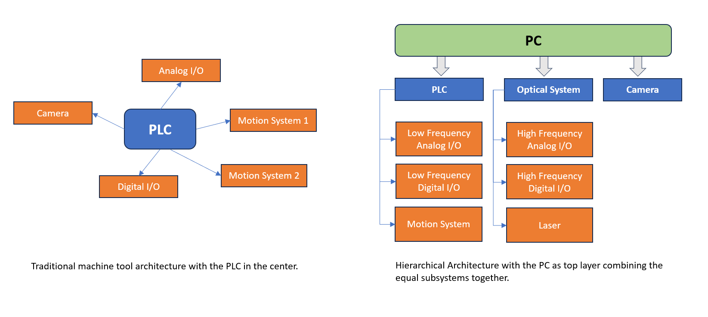
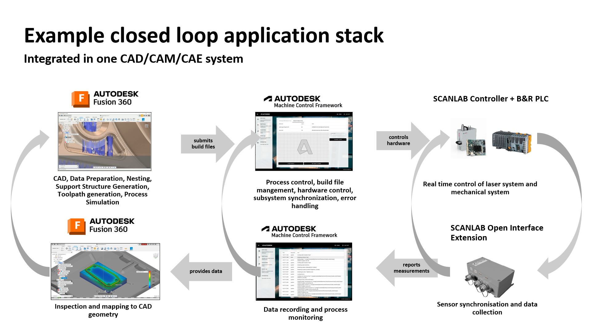

 
 

 

 
 
 

# Introduction to the Autodesk Machine Control Framework

## 1. Background Information & Justification

The standard control software for contemporary Additive Manufacturing Machines significantly deviates in a few areas from conventional machine tools, like Milling and Turning machines. While in the latter the operating model is centered around the real-time PLC and complex motion control, in the Additive Manufacturing space (at least for Laser Powder Bed Fusion, Stereolithography and Inkjet technologies) the motion aspect is less critical on the one hand, but on the other hand it is essential to integrate optics and other control systems that are structurally equal, while operating at a much higher frequency (MHz clock rate) in comparison of common PLCs (kHz clock rate).

In addition to those requirements, the amount of data that needs to be processed is often several magnitudes above what is usually needed in traditional Manufacturing. Build files for large prints can easily reach up to 10 or 20 Gigabytes, easily exceeding the capacity of contemporary real-time control systems.

As a result, the mostly applied software architecture usually consists of a standard PC running the different hardware components in parallel, trying to feed them with the data needed and orchestrate their behavior. There might be a direct wire link between the subsystems for clock synchronization, but even this is not state of the industry.

 

While the traditional space has seen some developments into more connected workflows (using for example UPCUA) in the recent past, but it is still very clear that the focus and central element of a machining process is still the G-Code-like program running in the PLC directly.

Given this speciality, every AM vendor is usually investing heavily in building its own PC control software stack completely from scratch - for a relatively low unit count. This leads to 
- a very fragmented market of proprietary solutions 
- many resource constraints of the necessarily small development teams, resulting in often low software quality
- many overlapping developments in different companies of the same functionality
- while building out their technological core differentiation only receives a tiny fraction of the overall effort.

As users of Additive Manufacturing Machine Tools in general operate a multitude of different machine formats and vendors, this fragmentation creates huge pains in the upstream and downstream process chain (from data preparation to quality control and postprocessing), being a real blocking issue for many applications to become main-stream.

The Autodesk Machine Control Framework is an open software collection that tries to address all of those issues in a structured manner. Similar how Android (TM) has been a backbone and level-setter for the mobile phone industry, it glues together the Upstream CAD/CAM data preparation pipeline with off the shelf hardware components that are sold in the market, trying to become a state of the art reference implementation of how a modern (additive) machine tool software stack should look like from the software side.

Taking away tedious repetitive reimplementations of non-value adding features, this has turned out to be an incredible productivity gain for software teams. Independent if they are trying to build up test systems, commercial grade machines or even retrofitting older machines with new control systems - the case available studies about the Framework's customizability show that it is easily possible for a small team of individuals to develop a completely novel state of the art machine tool within a few months - in industrial product quality.

While most of the work focuses on Laser-based technologies like Metal Laser Powder Bed Fusion and Stereolithography, the basic addressed challenges apply to a much wider range of technologies (like Injket, DLP or Binder Jetting), and also in a field outside of Additive Manufacturing. We do believe that there is a place for the concepts in traditional Manufacturing adjacent AM processes like DED or even Robotics as well, but to stay focused this is out of scope at the foreseeable future.

## 2. Example use case

The whole project was created around a first model use case, based on a tight integration of a CAD/CAM solution (like Autodesk Fusion) and a Machine Control System with a closed feedback loop. Fusion is Autodesk's main stream solution for Manufacturing, covering a wide range of functionality. From Mechanical Design, Generative and Implicit Design to Finite Element Analysis with a variety of Physics - to Manufacturing. The Manufacture environment in Fusion supports several processes, for example 3, 4 and 5 axis milling, turning, sheet-metal cuttong and also of course Metal Additive Manufacturing, both in DED and Laser Powder Bed Fusion. The idea is to provide a mainstream audience access to the technology, with an accessible ease-of-use as well an unbeatable price tag. Looking at the specifics, we assume a closed loop process like the following.

 

The desired model workflow steps are

- Prepare parametric models in CAD for Printing, which means orientation, support generation

- Simulate the process with a predictive FEA simulation

- Create and preview the laser toolpath depending on assigned settings at the CAD geometry.

- Automatically send the toolpath to the Machine Control, which handles data management,  hardware control, subsystem syncronization, error handling, etc..

- The hardware consists of off the shelf components from SCANLAB and B&R Automation, which then are used to melt the part.

- The process is monitored with cameras and off-the-shelf in-situ process monitoring solutions, for example a pyrometer from Sensortherm GmbH.

- The data is captured, fed back into the Machine Control Software, which aggregates several sensors from subsystems, and forwards an aggregate view back into the CAD system, where for example it can be overlayed with the earlier process simulation.

- In case there are deviations, or unwanted side effects, there is the possibility to run an outer process loop, which included adapting the model geometry, orientation, toolpathing or support strategy.

- Another option is to use the Control Framework's openness to directly create an in-process control of laser parameters dependent on a non-realtime measurement.

- The third control possibility is to directly use SCANLAB's off the shelf closed-loop control mechanisms to directly influence the melt-pool temperature to a specific regional target that was given in the CAD system or toolpathing kernel.

This workflow depicts pretty much the standard frontier technology state of Academia and the industry. It is important to highlight that the named software and hardware references are examples only, and the flexibility and openness of the framework shall encourage the mixing and matching of any sort of device in any price range. There is no vendor lock in of any kind. Having said that, the implementer's life will of course be much easier if he or she uses already supported components.

As a first principle, the target of this project is not to proof that it is possible at all to create such an implementation per se. The real goal was much more extensive: Creating a framework that allows a small team of engineers with sufficient knowledge of Mechanical Engineering and the AM Process to create such a system within a few months from scratch - without having to have decades of experience in Software Engineering on the one hand - but nevertheless in industrial grade quality on the other.

We strongly believe that this has the potential to free resources and speed up iterative developments. Maybe enough to really increase the velocity of technology developments. And all of this while creating a direct path to production ready deployment of results, an issue that is very endemic for Academic and Corporate Research organisations alike.

## 3. Acknowledgements

The work on this project was mainly pushed by Autodesk Inc. in its quest to make Additive Manufacturing an often applied mass market main-stream technology. But it would not have been possible without many participants and contributors, which are too numerous to name conclusively. As main industrial collaboration partners, we would like to highlight

 

- SCANLAB GmbH, the world's leading manufacturer of Laser Scan Systems and other Hard- and Software Components that move laser spots around.

 

- B&R Automation (A member of the ABB Group), one of Europe's leading provider of PLC systems in general and for the Additive Manufacturing Market.

 

- Nokia SLM Solutions GmbH, probably the world's leading provider of large scale multi-laser systems. We are tremendously grateful for the exploratively openness of them to try out the framework for some of their farer out R&D technology projects.

The amount of advice and credibility that this collaboration has received from all of them is invaluable.

On the academic side, we are very grateful to our Institutional partners, which guard decades of application experience and were great first-movers to build out the software stack with real-world

- Technical University of Munich, Institute for Machine Tools and Industrial Management (iwb)

- Technical University of Munich, Professorship of Laser Based Additive Manufacturing

- University of Aalen, Laser Application Center (LAZ)

- University of Nottingham, Advanced Manufacturing Center

- ETH Zürich, Advanced Manufacturing Laboratory

- Technical University of Denmark

And finally we would like to thank the uncountable amount of high profile industry leaders on all continents who have let us waste their time to listen to our conceptual presentations. And then in return even gave us free of charge consulting with real-life feedback and requirements gathering that in aggregation nobody would have been able to come up with in isolation.

This project has probably been the most extensive and wholistic requirements engineering exercise that has been conducted so far in the Additive Manufacturing Industry.

## 4. Open Source methodology

In a commercial context, the machine control software often is seen a sensitive topic by a Machine Tool Maker. It directly touches the crown jewels of its intellectual property, and any proprietary outside dependencies are regularly subject to strict scrutiny. We strongly believe that any viable business proposal in this area must include a complete code ownership by the OEM.

There might be other commercial models supporting those constraints - like detailed maintenance contracts with source code escrows. However, as real world experience shows, the legal and monetary arrangements in those cases are extraordinary complex. The negotiation and execution of such contracts often proves to be very difficult, especially if they have to be uphold over long time periods.

The associated risks are hard to estimate. Small supplier companies at any time can go bankrupt in an upcoming crisis, larger corporations are prone to regular changes in strategy and even divestments of whole business lines. In the rare best case the extensive paperwork is well-written and does not contain inherent inconsistencies. But even then the Machine Tool Vendor might be legally protected and entitled to a continuous operation in theory - while in practice facing the reality of a sudden loss of technical access to his business critical software stack.

In our opinion, the cleanest, easiest, and most attractive option is to maintain a central Framework code under a permissive open source license. While this does not 100% avoid any maintenance risk, it at least opens a realistic path to independence should the supplier relationship become impacted in any form.

While there are many open source licenses that would fit, the selected one ideally should be as short and clear as possible. Self-perpetuating licenses like GPL or LGPL add complexity and are not in line with creating applications in commercial environment.

## 5. License

Following the above philosophy, if it is not explicitely mentioned otherwise (like for third party dependencies), all documents and code of this project fall under the BSD 3 clause license, as stated below. This includes commercial and non-commercial use without the need for the user to disclose proprietary modifications to the public.

____

Copyright (C) 2024 Autodesk Inc. 

All rights reserved.

Redistribution and use in source and binary forms, with or without
modification, are permitted provided that the following conditions are met:
*  Redistributions of source code must retain the above copyright
	  notice, this list of conditions and the following disclaimer.
*  Redistributions in binary form must reproduce the above copyright
	  notice, this list of conditions and the following disclaimer in the
	  documentation and/or other materials provided with the distribution.
* Neither the name of the Autodesk Inc. nor the
	  names of its contributors may be used to endorse or promote products
	  derived from this software without specific prior written permission.

THIS SOFTWARE IS PROVIDED BY THE COPYRIGHT HOLDERS AND CONTRIBUTORS "AS IS" AND
ANY EXPRESS OR IMPLIED WARRANTIES, INCLUDING, BUT NOT LIMITED TO, THE IMPLIED
WARRANTIES OF MERCHANTABILITY AND FITNESS FOR A PARTICULAR PURPOSE ARE
DISCLAIMED. IN NO EVENT SHALL AUTODESK INC. BE LIABLE FOR ANY
DIRECT, INDIRECT, INCIDENTAL, SPECIAL, EXEMPLARY, OR CONSEQUENTIAL DAMAGES
(INCLUDING, BUT NOT LIMITED TO, PROCUREMENT OF SUBSTITUTE GOODS OR SERVICES;
LOSS OF USE, DATA, OR PROFITS; OR BUSINESS INTERRUPTION) HOWEVER CAUSED AND
ON ANY THEORY OF LIABILITY, WHETHER IN CONTRACT, STRICT LIABILITY, OR TORT
(INCLUDING NEGLIGENCE OR OTHERWISE) ARISING IN ANY WAY OUT OF THE USE OF THIS
SOFTWARE, EVEN IF ADVISED OF THE POSSIBILITY OF SUCH DAMAGE.

## 6. Contributions

Contributions are welcome and we are looking for people that can improve the core system as well supply new drivers or hardware interfaces.

You can also contribute by reporting bugs in the Issue tracker on github, helping review pull requests, participate in discussions about issues and more.

### Filing issues
1. When filing an issue to report errors or problems, make sure to answer these five questions:
	1. Which version of the Autodesk Machine Controller Framework are you using?
	2. Which operating system, programming language(s) and development tools (compiler/interpreter) are you using?
	3. What did you do?
	4. What did you expect to see?
	5. What did you see instead?
2. When contributing to this repository, please first discuss the change you wish to make via issue with the [maintainers](#maintainers) of this repository. This way, we can ensure that there is no overlap between contributions or internal development work.

3. Adhere to the code of conduct..

4. Review, sign and send in either the "Autodesk Machine Control Framework Form Corp Contrib Agmt for Open Source.pdf" if you want to contribute as a corporation or the "Autodesk Machine Control Framework Form Ind Contrib Agmt for Open Source.pdf" (both files are in the main folder of the official github repository) if you want to contribute as an individual.

### Submitting a pull request
When ready to contribute, fork this repository and submit a pull request that references the issue it resolves. Be sure to include a clear and detailed description of the changes you've made so that we can verify them and eventually merge.

The Autodesk Machine Controller Framework follows the [git-flow](https://www.atlassian.com/git/tutorials/comparing-workflows/gitflow-workflow) branching model. New developments are integrated into the [develop](../../tree/develop)-branch. The maintainers will create releases from the develop-branch when appropriate.

If you've established yourself as an impactful contributor to the project, and are willing take on the extra work, we'd love to have your help maintaining it! Email the current maintainers for details.

# I The AMCF Core System

## 1. Engineering Principles and Design choices

The following chapter shall outline the philosophical principles that were followed during the development, as well as the design choices that follow as consequence.

### 1.1. Separation of Framework and Machine specialization

In our decade-long experience in operating Additive Manufacturing machines, we have seen many different approaches to implement a proper machine control software stack. Most software solutions in the field are custom made for a certain machine series, with a large variation in certain aspects like user experience, but at the same time being very similar on what they do at the core. Depending on the market, history and development resources, a vendor would make or have to make different choices, and subject itself to different constraints. Looking wholistically, the overlap between different software stacks is striking none-the-less, and the question arises, if one could develop a common architecture for a majority subset of available systems.

The key to create such a reusable system is a proper level of abstraction. It is essential to capture most of the possible functionality of an industrial Additive Manufacturing system, and implement it into the core. But to adapt to different printing technologies, one also needs to create an extensive plugin system that allows to specialize the framework to most specific use cases.

We believe the core should at least cover the following areas, which are broadly applicable for most Additive Manufacturing Processes:

- A Deterministic execution logic on the system, containing all state defining variables.

- Proper Version control of all system components

- User management, support for user roles and authentication

- An established logging system, with hierarchical granularity

- A reusable mechanism for quick development of User Interfaces and HMI

- A concept how to include proprietary hardware and SDKs

- A backend relational database for storing meta data

- Data schema versioning and migration schemes for updating

- Proper binary data management (Build files, image data etc..)*

- Build data parsing and extraction

- Multi-threading and subsystem synchronisation

In addition to those specifics, more in general we believe the framework should also provide functionality that is usually shpped via third party libraries that are often painstakenly difficult to include in a large project. This includes

- XML, JSON and ZIP parsers/writers

- Generic TCP/IP Networking code

- Generic OPCUA connection functionality

- Other connectivity support, for example UART and ModbusTCP

- Statistics and Time Series

- Image compression, display and manipulation

- Slicing and rasterization algorithms

- Video capture, display and manipulation

- Date and time functionality, timing measurements

- Hash- and Cryptographic functions

- HTTP Clients and REST Servers

- LDAP and other identity protocols, Corporate single sign on

- OpenGL, 3D Graphics and Shader programming                   

- Cloud connectivity and remote control

None of the two dozen points above have any direct connection to a machine maker's process knowledge, and are usually just experienced as cost factor by the software team in charge. And they not only make up a small fraction of the overall effort - but span the majority of the resource investment. The reusuability of this costly, non-differentiating 

### 1.2. Multi-platform, Multi-user, Multi-language Design

While developing a framework with a platform concept in mind, dealing with as many use cases as possible must be one of the priorities. This means to support the big 3 M's:

**Multi-platform:** The code should compile and run on most hardware, operating systems and processor architectures. In our case we would make sure the codebase can compile on:

1. Windows x86, 32bit ("win32")

2. Windows x64, 64bit ("win64")

3. Linux x86, 32bit ("linux32")

4. Linux x64, 64bit ("linux64")

5. Linux ARM, 32bit ("arm32")

6. Linux ARM, 64bit ("arm64")

7. Mac OS X Intel ("mac64")

8. Mac OS X ARM ("macarm")

As those are many configurations, in order to balance complexity with the need of the majority of applications, we will publish precompiled binary releases for the top three platforms in the field (win64, linux64, arm32).

**Multi-user:** User authentication is a complex topic, which really should not be left to the specialization code. The framework should come with a proper login system and user database, which allows to record who did what and when in the operating and administration modes of the machine. The user experience should be tailored to a certain assigned user role, and there should be a permission mechanism to ensure that nobody can perform actions exceeding one's role priviledges.

**Multi-language**: In order to be a commercially viable software solution, the framework should also come with its internal internationalization scheme that allows it to support multiple client-facing languages in a dynamic way - which means the language setting should be on a per-user basis and be changeable either instantaneously or between logins.

### 1.3. Modular Architecture and the need for a Client-Server system

There are a lot of ways and opinions how one could define a modular architecture. 

### 1.4. Plugin mechanism and choice of programming language

### 1.5. The Hourglass pattern and Stable ABIs

### 1.6. API First Design guidelines and best practices

### 1.7. Serialization principles, XML, JSON and binary storage

### 1.8. Resource handling and file access

### 1.9. Database backend, Schemas and Data Migration

## 2. Engineering Lifecycle Considerations

### 2.1. Code degradation and successful development over many years

### 2.2. Using of git hashes in the core code

### 2.3. Stable APIs, Backwards compatibility and Data migration

### 2.4. Separation of Data and Logic and forward compatibilty.

### 2.5. Package management, CI/CD and proper build pipelines.

### 2.6. Testing Framework

## 3. General Backend Architecture

### 3.1. Client Server Implementation

### 3.2. Finite State Machines

### 3.3. Signals and Concurrency

### 3.4. Driver Concept and Statefulness

### 3.5. Build data management

### 3.6. 3MF Toolpath and Metadata

### 3.7. Logging and Journaling

### 3.8. Determinism and Replay

### 3.9. Implementation constraints

### 3.10. Resource sharing and driver locks

### 3.11. Consuming proprietary SDKs

## 4. Machine specialization

### 4.1. The Configuration XML

### 4.2. Language Definitions

### 4.3. Permissions and Role models

### 4.4. Alert System

### 4.5. State machines, Variables and Signal Definitions

### 4.6. Plugin Mechanism

### 4.7. The API Environment

### 4.8. Essential StateEnvironment Methods

### 4.9. A minimal machine flow example

## 5. Advanced API Functionality

# II The AMCF User Interface System

## 1. Generic Concept

### 1.1. Pages, Dialogs and Modules

### 1.2. Overview of Widget system

### 1.3. Custom pages

### 1.4. User Interface Plugin Mechanism

### 1.5. The API Environment

### 1.6. Events and Essential UIEnvironment Methods

## 2. Module Documentation

### 2.1. Content Module

### 2.1.1 Paragraph Widget

### 2.1.2 Image Widget

### 2.1.3 Form Widget

### 2.1.4 ButtonGroup Widget

### 2.1.5 Chart Widget

### 2.1.6 Upload Widget

### 2.1.7 ParameterList Widget

### 2.1.8 BuildList Widget

### 2.1.9 AlertList Widget

### 2.2. LayerView Module

### 3.3. Logs Module

### 3.3. Graphic Module

### 3.4. GLScene Module

### 3.5. Grid Module 

### 3.6. Tabs Module 

# III Standard Driver Documentation

## 1. PLC and Motion Drivers

### 1.1. B&R Automation TCP/IP Driver

### 1.2. Beckhoff ADS Driver

### 1.3. Hilscher cifX Driver 

### 1.4 Siemens S7PLC Driver

### 1.5 Technosoft TML Driver

### 1.6. Aerotech A3200 Driver

### 1.7. Standa XIMC Driver

## 2. Scanner Drivers

### 2.1. SCANLAB RTC6 Driver

### 2.2. Raylase Driver

###  2.3. HA Laser Systems Driver

## 3. Open Communication Drivers

### 3.1. OPCUA Driver

### 3.2 TCP/IP Driver

### 3.2 UART Driver

### 3.3. GRPC Driver

### 3.4. Marlin Driver

## 4. Auxiliary Device Drivers

### 4.1. SCANLAB Open Interface Extension Driver

### 4.2. SCANLAB scanMotionControl Driver

### 4.3. FLIR Spinnaker Driver

### 4.4. Rasterizer Driver

### 4.5. Beckhoff BK9xxx Driver

# IV Development environment

## 1. C++ Compiler, CMake, Git

## 2. Setting up a Developer Environment on Windows

## 3. Setting up a Developer Environment on Linux x64

## 4. Setting up a Developer Environment on Linux ARM

## 5. Code Dependencies

# V Custom Driver Development

# VI Features

# VII Requirement Engineering and Future Roadmap

# VII Tutorials

# VIII AMCF REST API Documentation

