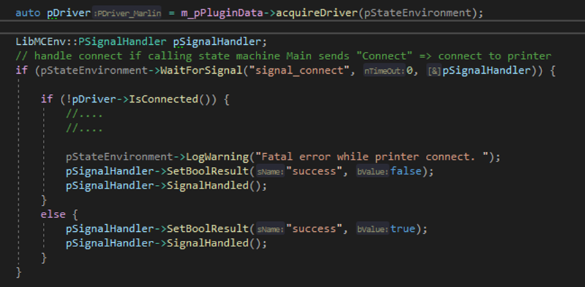

| [Prev](part02.html) | [Getting Started -- Table of Contents](index.html) | [Next](part04.html) |
# Part 3:  Existing plugin UserInterface

## UserInterface (UI)
With the UI plugin you’re able to configure the UI of AMCs webpage and you’re able to add functionality. There’re two parts to control the UI. 
Part 1 configures the controls to be displayed on the webpage and part 2 defines events and the actions to be performed.
The UI of AMCF is built around state machines which can communicate via signals and changing parameter values. Using these signals, the UI can call actions defined in the state machine of the existing plugins.

### UI Part 1
The schema for the UI is located in the config.xml file, found in AutodeskMachineControlFramework_???/Plugins. A prefix (githash) will be added to the name of the xml file and this file (“run time version”) of the config file will be copied to folder “build\Output” by the build process of the solution. Running the amc_server.exe uses the “runtime version” of the config file.
Among other things, the file contains several sections to define installed drivers and all state machines.
The samples below are all referencing the FFF branch of AMC.

The section <userinterface> is used to define the layout of the UI. The UI is split into pages containing content. Each page added will show as a unique tab on the navigation pane of the AMCF UI.

An example construction is shown below:

The supported attributes of section userinterface are listed below.
appname: Name of application.
copyright: Copyright text.
mainpage: Page displayed on startup (Home page).
library: Library to handle events defined on webpage.

#### Supported UI Sections/Tags
Currently supported UI Sections/Tags are:

**page:** 
Defines a page and its name.

**content:** 
Defines the content of a page. Its name, the title and subtitle.

**paragraph:**
Paragraphs display text to the user, specified by the text parameter.

**upload:**
Upload adds a button with a paper clip image to the page and pressing the button allows a user to upload a file to AMCF. Class specifies the functionality called, caption specifies the text alongside the upload and successpage specifies the page to load after upload is completed.

**buildlist:**
Defines the list displayed on the page, containing the already loaded jobs. Loadingtext shows some text. Entriesperpage defines the number of already loaded jobs to be displayed in the list and detailpage specifies the page to load after a job is selected for build.

**layerview:**
Shows a graphics area to display the selected toolpath layer by layer and two slider to control the visualisation. The upper slider (layer index) is to control the layer to be displayed and the lower slider (scaling) controls the scaling.

**image:**
Displays an image, specified by attribute resource, on the webpage. The aspect ratio and the max height/width can be set.

**buttongroup:**
Defines a group of buttons. Must be followed by at least on tag of type \<button\> (see below).

**button:**
Defines a button to be displayed on the webpage. Caption defines the text shown on the button, targetpage defines the page to display after button was pressed and event defines the event to be fired. The event will be handled in part 2 respectively the UI plugin (mc_userinterface.cpp).

**menu:**
Defines the menu displayed on the left side of the page and must be followed by at least on tag of type <item> (see below)

**item:**
Defines a menu item to be displayed on the webpage. Caption defines the text shown as menu item, targetpage defines the page to display after menu item was pressed, icon shows the image displayed to the left of the menu text and id defines the internal group the menu items belongs to.

**parameterlist:**
Plugins can define a set of parameters. These parameters can be used to transfer data within and between plugins. They also can be displayed on AMCs webpage. Attribute loadingtext shows some text displayed above the list. Parameterlist must be followed by at least on tag of type <entry> (see below). 

 
**entry:**
Defines the parametergroup to be displayed on the webpage. Statemachine defines the state machine respectively the plugin the parameter are defined in and group defines the subset of parameters in each state machine.

**toolbar:**
Defines the toolbar displayed on the upper right of the page and must be followed by at least on tag of type <item> (see below)

**item:**
Defines a menu item to be displayed on the webpage. Caption defines the text shown as menu item, targetpage defines the page to display after menu item was pressed, icon shows the image displayed to the left of the menu text and id defines the internal group the menu items belongs to.

  
### UI Part 2
Attribute library of tag <userinterface> defines the plugin respectively library to handle the events defined on webpage.
Folder .\Plugins\UI contains the file “mc_userinterface.cpp” and this file contains the source code to handle the events defined in Part 1 (config.xml).
For every event, defined in config.xml, a corresponding class exists in mc_userinterface.cpp.
 

The function “getEventName” must return the same name as defined in config.xml and the method “handle” contains the code to run after the event is fired on the webpage.

First, “Handle” checks if the parameter is valid. If not, an exception is thrown.
Second, “Handle” prepares a signal, triggers it and waits (WaitForHandling(10000): argument ≙ time to wait in ms) until the signal is handled by the called function.
Signals are used to communicate between plugins. To do this the signal must be defined in the plugin that should receive the signal. In this case it’s the plugin “PrinterConnection”. 
In section \<statemachine name="printerconnection" … \> of the config.xml the needed signal is defined like this:

All events must be registered to the system by calling createEventInstanceByName in the function CreateEvent. 

In the plugin “printerconnection” (mcplugin_printerconnection.cpp) the code to handle the signal must be added:

The code above waits for the signal “Signal_connect”. If it occurs, it checks if the printer is connected, sets the “BoolResult” accordingly, sends the result as feedback by calling “SignalHandled”.

