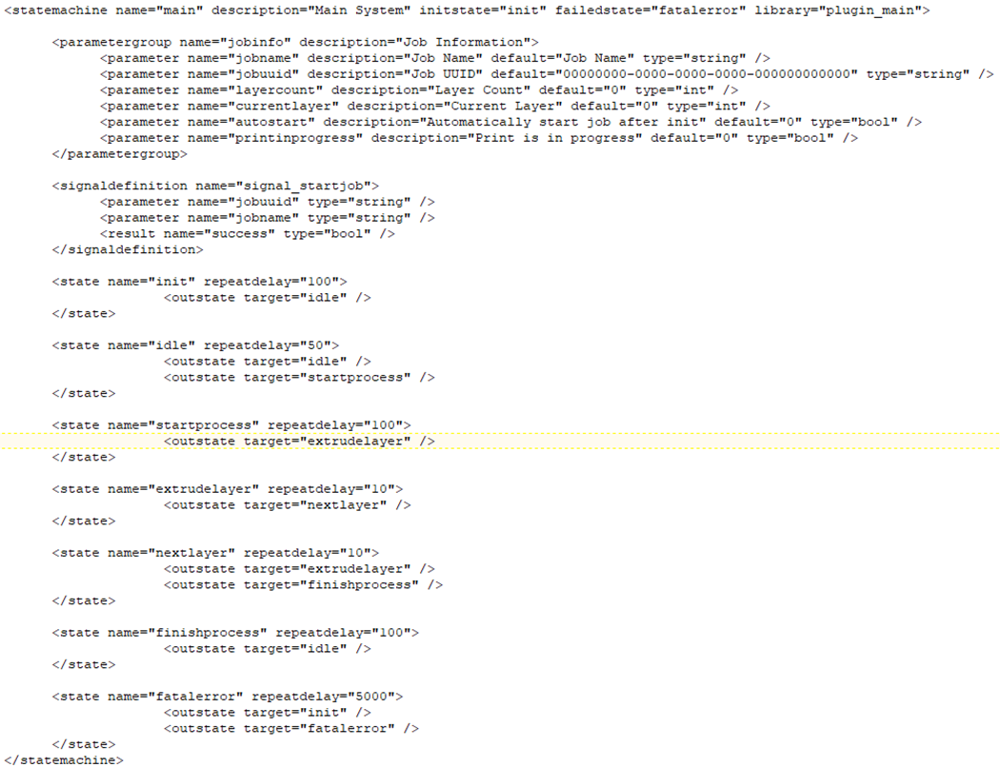
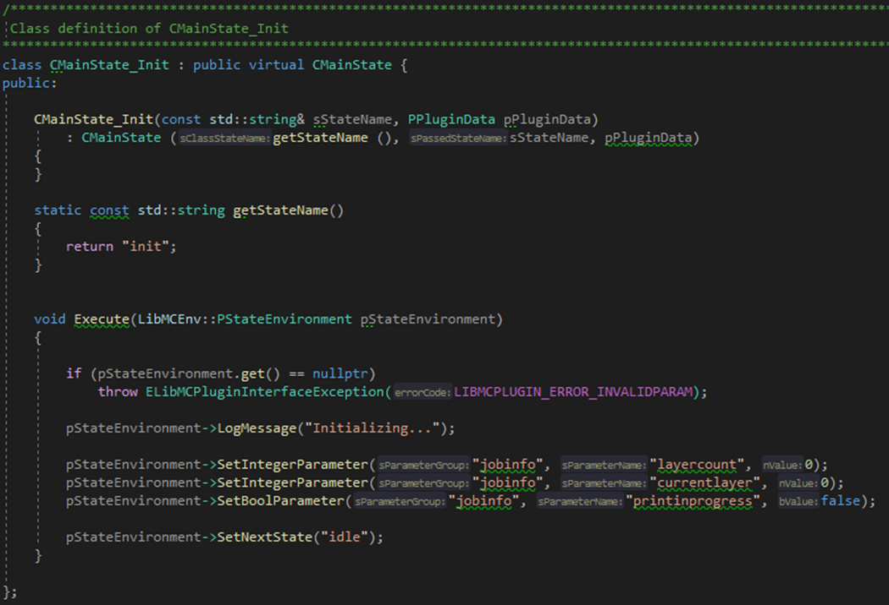
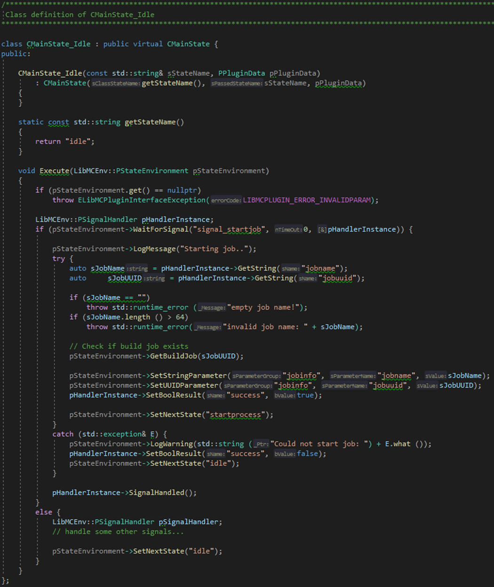
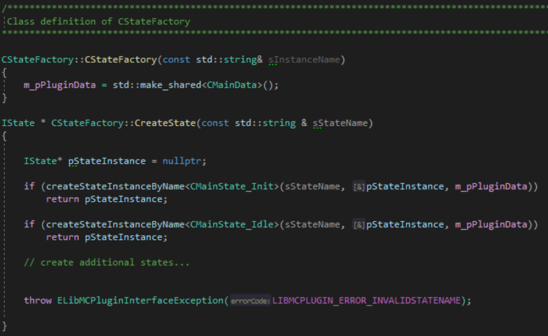

| [Prev](part03.html) | [Getting Started -- Table of Contents](index.html) | [Next](part05.html) |
# Part 4:  Existing plugin Main

## Main
As the UI plugin the Main plugin has also two parts where the functionality is configured/implemented. Part 1 is located in section \<statemachine\> (name=”main”) in the config.xml file (see UI above) and part 2 is represented by file “mcplugin_main.cpp” in folder “.\Plugins\Main”.

### Main Part 1
The section <statemachine> configures the content and behaviour of a state machine. The attribute name defines the name, description is used to describe it in more detail, initstate defines the state to start with, failedstate defines the state to jump in, when an error occurs, and library defines the plugin that handles the functionality of the state machine. The attribute library corresponds to the source code of the plugin (.\Plugins\Main\mcplugin_main.cpp) that relates to the state machine.

**parametergroup:**
A parametergroup is used to define a set of parameters used by the plugin and must be followed by at least on tag of type \<parameter\> (see below). The group has a name and a description. The name is used to specify the group of parameters to display in the web UI for example (see UI, parameterlist – entry). These parameters can be used to transfer data within and between plugins or to modify default values of these parameters by editing the config.xml.

**parameter:**
Parameter specifies a parameter, its name and description as well as the data type and the default value. The name of the parameter and the group is used in the plugin to access the data.

**signaldefinition:**
Signaldefinion defines a signal handled by this statemachine. This signal can be called from within the current or from another state machine respectively plugin (like UI). It’s possible to add some parameters to the signal. With a parameter, data can be transferred to the plugin. Result defines name and type of the data send back to the calling plugin, after signal is processed.

**state:**
State defines the different states the plugin must handle. For each state, identified by name, a corresponding class in the plugin must exist. The class implements the desired functionality, processed by activating the state. Repeatedly defines a time to wait before the function can be called again. The first state to activate, after initialising the system, is defined in the definition of the state machine (see initstate). The possible states that could be activated from the current state are defined by the tag \<outstate\> (see below).

**outstate:**
The attribute target of outstate defines the possible next state that could be activated by the plugin.

### Main Part 2
Attribute library of tag <statemachine> defines the plugin respectively library to handle the states defined in the state machine.
Folder .\Plugins\Main contains the file “mcplugin_main.cpp” and this file contains the source code to handle the states defined in Main Part 1 (config.xml).
For every state, defined in config.xml, a corresponding class exists in mcplugin_main.cpp.
This first state to call while initialisation is defined by the attribute initstate. In this case the state init is called.

The function “getEventName” must return the same name as defined in config.xml and the method “Execute” contains the code to run after the state is activated by the state machine.

First, “Execute” checks if the parameter is valid. If not, an exception is thrown.
Second, “Execute” outputs a message on the command line and then some of the defined parameters, specified in config.xml by parametergroup and parameter, are changed.
Finally the next state is activated.

The function “getEventName” must return the same name as defined in config.xml and the method “Execute” contains the code to run after the state is activated by the state machine.

First, “Execute” checks if the parameter is valid. If not, an exception is thrown.
Second, “Execute” checks wheter signal “signal_startjob” has been sent by another state respectively by another state machine (“start job” sent by UI). 
If yes, the job to start is determined by extracting the job information from the received signal. After checking if the received job data is valid, the job data is stored the corresponding parameters of the state machine “Main” for future use, the received signal gets its confirmation (success=true) and finally the next state “startprocess” is activated. If an error occurs an error message is logged, the signal feedback will be set to not successful and the next state idle is called (don’t continue with “startprocess”).
At the end “SignalHandled” transfer the signal confirmation to the calling state.
The other states are processed similarly.

All states must be registered to the system by calling createStateInstanceByName in the function CreateState. 

