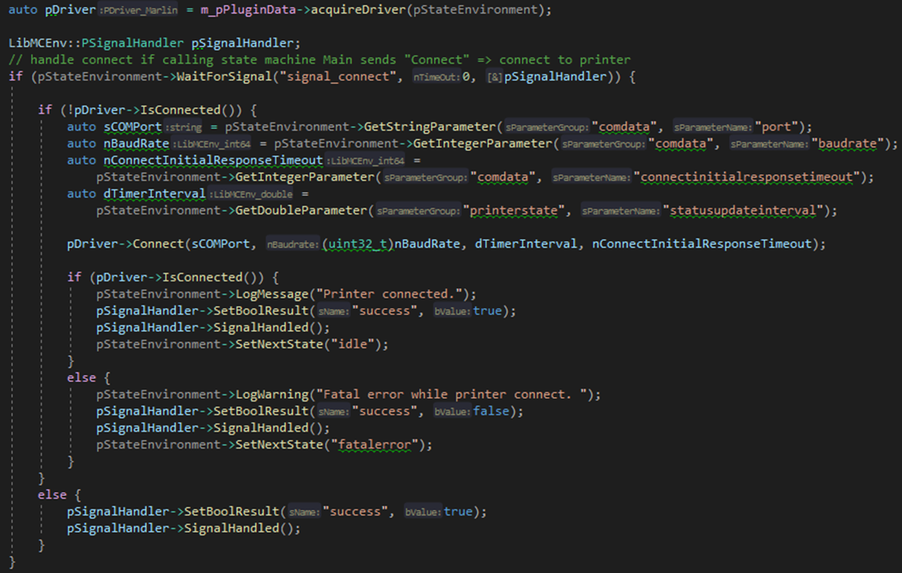

| [Prev](part04.html) | [Getting Started -- Table of Contents](index.html) | [Next](part06.html) |
# Part 5:  Existing plugin PrinterConnection

## PrinterConnection
As the UI plugin the PrinterConnection plugin has also two parts where the functionality is configured/implemented. Part 1 is located in section \<statemachine\> (name=” printerconnection”) in the config.xml file (see UI above) and part 2 is represented by file “mcplugin_printerconnection.cpp” in folder “.\Plugins\PrinterConnection”.

### PrinterConnection Part 1
The section <statemachine> configures the content and behaviour of a state machine. The attribute name defines the name, description is used to describe it in more detail, initstate defines the state to start with, failedstate defines the state to jump in, when an error occurs, and library defines the plugin that handles the functionality of the state machine. The attribute library corresponds to the source code of the plugin (.\Plugins\PrinterConnection\mcplugin_ printerconnection.cpp) that relates to the state machine.
The content of state machine printerconnection is similar to state machine main. It contains also prametergroups, signaldefinition and state (see “Main” for more information).
The tag <driverparametergroup> implements some new functionality. Because PrinterConnection uses the concept of “Driver” some driver parameters are defined in the corresponding source code file (see PrinterConnection Part 2 for more information). To display the defined driver parameters on the web page and/or to make it accessible/readable by the plugin, add tag <driverparametergroup> to the state machine. Name defines the name of the parameter group, description provides some more information and driver specifies the driver that contains the driver parameters.

The tag \<driver\> defines the driver to be supported by the plugin. Name defines the name, library the library to use and type a special variant of the driver. The type can be used in the function CreateDriver of the driver to support different functionality of different (firmware) types (see PrinterConnection part 2).

### PrinterConnection Part 2
Attribute library of tag \<statemachine\> defines the plugin respectively library to handle the states defined in the state machine.
Folder .\Plugins\PrinterConnection contains the file “mcplugin_ printerconnection.cpp” and this file contains the source code to handle the states defined in PrinerConnection Part 1 (config.xml).
The content of the plugin printerconnection is similar to plugin main (see “Main” for more information).

### PrinterConnection Driver
An extension to plugin printerconnection is the usage of a driver. A driver is used to interface with another tool or hardware. Drivers are located in the folder “.\Drivers”. The plugin printerconnection uses the driver “Marlin” to connect a 3D printer (FFF) that has a Marlin firmware using a serial interface.
The device/printer specific functionality is implemented in the file AMC_SerialController_Marlin.cpp (located in folder .\Drivers\Marlin\Implementation). This file contains the code to setup the serial connection, connect the printer, initialise it, check if it’s homed, set extruder temperature, send move commands etc. 
The second important source code file is libmcdriver_marlin_driver_marlin.cpp (also located in folder .\Drivers\Marlin\Implementation). This tool provides the interface to the plugin printerconnection. In the constructor the parameters of driver Marlin are registered. The driver can set/get the values of the registered parameters and other plugins can access them also by using the tag \<driverparametergroup\> in the config xml (see PrinterConnection Part 1).
Using the attribute type of tag <driver> in function CreateDriver in libmcdriver_marlin.cpp gives the ability to extend type specific functionality.

To access the driver from within a plugin, some lines of code must be added to the plugin.

With the code above, added to plugin printerconnection, the marlin driver is accessible from within the plugin by calling the function “aquireDriver”.

Figure 32: Usage of driver from within a plugin.
The sample above (state idle) the plugin waits for signal “signal_connect”. If it receives the signal, it acquires the driver and then the plugin can check if the printer is connected, if not it can read the connection parameter, connect the printer, check if connect was successful and reply corresponding feedback to the state that has sent the signal.

## Marlin firmware update
### ADVANCED_OK
The main goal of AMC is to control and/or monitor the manufacturing process. AMC provides plugins and drivers to get better access to the hardware components. To get full control to the print process it’s necessary to do not block the command queue of the printer by sending to many commands. A blocked command queue results in the message “busy” and other commands can’t be processed at this state. In this case an immediate closed loop feedback is not achievable. 
To avoid a blocked command queue, we must send the next commands only when enough space is left in the command queue. To check if space is remaining, the Marlin firmware of the printer must be changed. With ADVANCED_OK activated, the firmware replies with extended information to a sent command. Instead of replying just OK “ADVANCED_OK” replies with the line number, planner space remaining and block queue space remaining. 

The **plugin expects ADVANCED_OK** as feedback to sent commands, 
it checks the remaining space by analysing the received OK string and 
it sends the next commands only if “buffer is available”.

See some information about buffering and ADVANCED_OK:

[Marlin Firmware - buffer/hosts](https://marlinfw.org/docs/configuration/configuration.html#buffer-/-hosts)

[Marlin Firmware - ADVANCED_OK](https://marlinfw.org/docs/configuration/configuration.html#advanced-ok)

[G-Code - buffering](https://reprap.org/wiki/G-code#Buffering)

To activate ADVANCED_OK the file “Configuration_adv.h” of the source code of the Marlin firmware (v 1.1.x) must be changed. 
To do so:

 -	Download firmware
 -	Edit file Configuration_adv.h
    -	Add “#define ADVANCED_OK” respectively search for “#define ADVANCED_OK” and remove comment before #define
 -	Save file, compile firmware and upload it to printer

Updating the firmware depends on the hardware/printer used. For more information on updating the firmware, refer to the printer/firmware documentation.
Marlin: 

[Marlin Firmware - Install](https://marlinfw.org/docs/basics/install.html)

Example of updating the firmware on an Ender 3 printer:

[Marlin Firmware - Update](https://howchoo.com/ender3/ender-3-bootloader-firmware-update-marlin)

**Validating Installation**

 -	Connect your computer to the 3D printer using the Micro USB cable
 -	Open terminal program and connect to the printers COM port
    -	The correct COM port can be found in Device Manager → Ports (COM & LPT)
 -	Enter GCODE commands
    -	G0 Z50: Moves Z axis to 50 
    - M114: Returns current position
 -	G0 should not be blocking, and allow M114 to return instantly
 -	Commands should return the value and an ok message with remaining buffer size (e.g ok P15)

### stepper.synchronize()
The M114 command (Get Current Position) should not put into the command queue. It must be processed immediately. If firmware v1.1.6.1 is used, the M114 is added to the command queue. To avoid this, the command “stepper.synchronize();” must be removed/comment out in method “gcode_M114()” of file “Marlin_main.cpp”.

To modify the firmware and update the printer with the new firmware see chapter “ADVANCED_OK”

