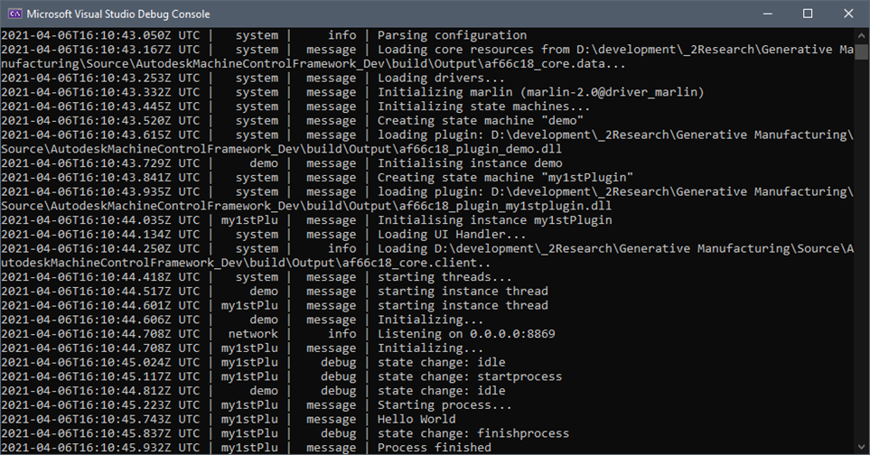

| [Prev](part05.html) | [Getting Started -- Table of Contents](index.html) | Next |
# Part 6:  How to add a new plugin to AMCF

If you want to add your own plugin you have to create some folder, copy some and edit some files. A simple plugin sample, to be used as a template, is the “Demo” plugin, located in branch “develop”.
To create your 1st “Hello World” plugin for windows, clone the branch “develop”, run “build_clean_win64.bat”, open the solution and build it (similar to the workflow described in previous chapter).

Following steps are to create a new plugin “My1stPlugin” as a copy of “Demo”.
- Navigate to folder “.\Plugins” (not to folder “.\build\Plugins”)
- Create new folder “My1stPlugin”
- Copy content of folder “Demo” to folder “My1stPlugin”
- Navigate to folder “My1stPlugin”
- Rename file “mcplugin_My1stPlugin.cpp”
- Edit CMakeLists.txt in the new folder and update line 37 with the name of your package.  So the corresponding line show look like this: `set (PLUGINPROJECT My1stPlugin)`
- Because this Plugin will not use any driver, remove everything that has to do with the use of a driver. In this case we do not need access to the Marlin driver. Remove also every no more needed functionality.


   **Remove following lines of code:**
   ```
   #include "libmcdriver_marlin_dynamic.hpp"
   #include "libmcenv_drivercast.hpp"
   ...
   typedef LibMCDriver_Marlin::PDriver_Marlin PDriver_Marlin;
   typedef LibMCEnv::CDriverCast <LibMCDriver_Marlin::CDriver_Marlin, LibMCDriver_Marlin::CWrapper> PDriverCast_Marlin;
   ```

   **Remove in Class CMainData following lines of code:**
   ```
   PDriverCast_Marlin m_DriverCast_Marlin;
   ...
   PDriver_Marlin acquireMarlinDriver(LibMCEnv::PStateEnvironment pStateEnvironment)
   {
	return m_DriverCast_Marlin.acquireDriver(pStateEnvironment, "marlin");
   }
   ```

   **Remove in Class CMainState_Idle following lines of code:**
   ```
   auto pDriver = m_pPluginData->acquireMarlinDriver(pStateEnvironment);
   pDriver->QueryParameters();
   ```

- Because this Plugin will not use any parameter (defined in *_config.xml) remove all usage of “parameters” and some other lines of no more used code (like toopath usage etc).

   **Remove in Class CMainState_Init following lines of code:**
   ```
   pStateEnvironment->SetIntegerParameter("jobinfo", "layercount", 0);
   pStateEnvironment->SetIntegerParameter("jobinfo", "currentlayer", 0);
   pStateEnvironment->SetBoolParameter("jobinfo", "printinprogress", false);
   ```

   **Remove in Class CMainState_Idle following lines of code:**
   ```
   LibMCEnv::PSignalHandler pHandlerInstance;
   if (pStateEnvironment->GetBoolParameter("jobinfo", "autostart")) {
	pStateEnvironment->SetNextState("startprocess");

   }
   else {
	if (pStateEnvironment->WaitForSignal("signal_startjob", 0, pHandlerInstance)) {
		pStateEnvironment->LogMessage("Starting job..");
		try {
			auto sJobName = pHandlerInstance->GetString("jobname");
			auto	 sJobUUID = pHandlerInstance->GetString("jobuuid");

			if (sJobName == "")
				throw std::runtime_error ("empty job name!");
			if (sJobName.length () > 64)
				throw std::runtime_error("invalid job name: " + sJobName);

			// Check if build job exists
			pStateEnvironment->GetBuildJob(sJobUUID);

			pStateEnvironment->SetStringParameter("jobinfo", "jobname", sJobName);
			pStateEnvironment->SetUUIDParameter("jobinfo", "jobuuid", sJobUUID);
			pHandlerInstance->SetBoolResult("success", true);

			pStateEnvironment->SetNextState("startprocess");
		}
		catch (std::exception& E) { 
		    pStateEnvironment->LogWarning(std::string ("Could not start job: ") + E.what ());
			pHandlerInstance->SetBoolResult("success", false);
			pStateEnvironment->SetNextState("idle");
		}
		pHandlerInstance->SignalHandled();
	}
	else {
		pStateEnvironment->SetNextState("idle");
	}
   }
   ```

   **Remove in Class CMainState_StartProcess following lines of code:**
   ```
   // Load Toolpath into memory
   auto sJobUUID = pStateEnvironment->GetStringParameter("jobinfo", "jobuuid");
   auto pBuildJob = pStateEnvironment->GetBuildJob(sJobUUID);
   pBuildJob->LoadToolpath();

   // Find out layer count
   auto nLayerCount = pBuildJob->GetLayerCount();

   pStateEnvironment->SetIntegerParameter("jobinfo", "currentlayer", 0);
   pStateEnvironment->SetIntegerParameter("jobinfo", "layercount", nLayerCount);
   pStateEnvironment->SetBoolParameter("jobinfo", "autostart", false);
   pStateEnvironment->SetBoolParameter("jobinfo", "printinprogress", true);

   pStateEnvironment->SetNextState("drawlayer");
   ```

   **Remove in Class CMainState_FatalError following lines of code:**
   ```
   // Unload all toolpathes that might be in memory
   pStateEnvironment->UnloadAllToolpathes();
   ```

- Because this Plugin will not the states DrawLayer and NextLayer remove all usage of these layers.

   **Remove Class CMainState_DrawLayer completely:**
   
   
   **Remove Class CMainState_NextLayer completely:**
   

   **Remove in Class CStateFactory following lines of code:**
   ```
   if (createStateInstanceByName<CMainState_DrawLayer>(sStateName, pStateInstance, m_pPluginData))
	return pStateInstance;

   if (createStateInstanceByName<CMainState_NextLayer>(sStateName, pStateInstance, m_pPluginData))
	return pStateInstance;
   ```

- Edit remaining source code.

   Find all occurrences of text “CMain” and replace it with “CMy1stPlugin” in the reaming source code.

   To proceed from state “idle” to state “startprocess” add following code 
   ```
   pStateEnvironment->SetNextState("startprocess");
   ```
   below existing lines
   ```
   if (pStateEnvironment.get() == nullptr)
	throw ELibMCPluginInterfaceException(LIBMCPLUGIN_ERROR_INVALIDPARAM);
   ```
   to class CMy1stPluginState_Idle.

   **Hello World**
   
   To do the “Hello World” add following code 
   ```
   pStateEnvironment->LogMessage("Hello World");
   pStateEnvironment->SetNextState("finishprocess");
   ```
   below existing lines
   ```
   pStateEnvironment->LogMessage("Starting process...");
   ```
   to class CMy1stPluginState_StartProcess.
   
- Add new plugin folder to list of supported plugins. To do so, open file “CMakeLists.txt” in folder “Plugins” and add following line to the end of the file.
   ```
   add_subdirectory(my1stPlugin)
   ```

- To handle the states of the new plugin we’ve to add some data to file “config.xml” in the folder “Plugins”. 
   Add the following lines to “config.xml”

   ```
   <statemachine name="my1stPlugin" description="How to add a plugin sample" initstate="init" failedstate="fatalerror" library="plugin_my1stplugin">
  	  <state name="init" repeatdelay="100">
  			<outstate target="idle" />
  	  </state>
  
  	  <state name="idle" repeatdelay="50">
  			<outstate target="idle" />
  			<outstate target="startprocess" />
  	  </state>
  
  	  <state name="startprocess" repeatdelay="100">	  
  			<outstate target="finishprocess" />
  	  </state>
  	  
          <state name="finishprocess" repeatdelay="100">	  
  			<outstate target="idle" />
  	  </state>
  		
  	  <state name="fatalerror" repeatdelay="5000">	  
  			<outstate target="init" />
  			<outstate target="fatalerror" />
  	  </state>
   </statemachine>
   ```

- Add new plugin to the list of packages. To do so, open file “???????_package.xml” in folder “.\build\Output” and add following line to the list of supported libraries (??????? represents the githash of the current build).

   `<library name="plugin_my1stplugin" import="af66c18_plugin_my1stplugin.dll" />`

- To rebuild the solution, that contains the new plugin, empty the “output” subfolder of folder “build” and run “build_clean_win64.bat” in the base folder.
- Open solution LibMC.sln in folder “.\build\output”, set libmcplugin_my1stplugin as Startup Project, build solution and run it. As a result, the command line output should look like this:



