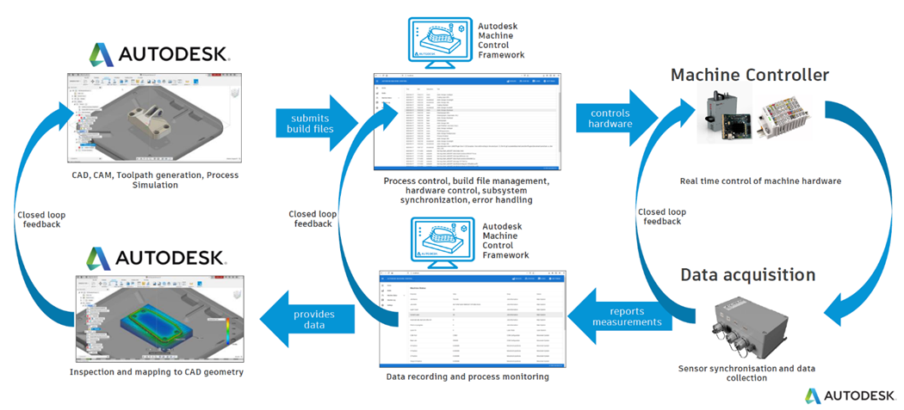
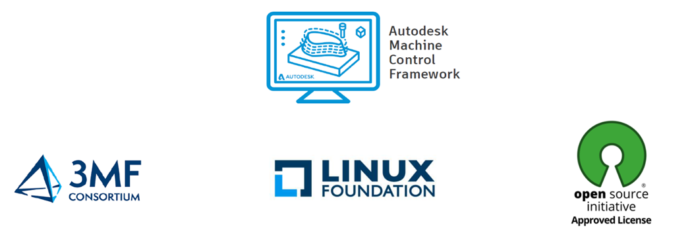
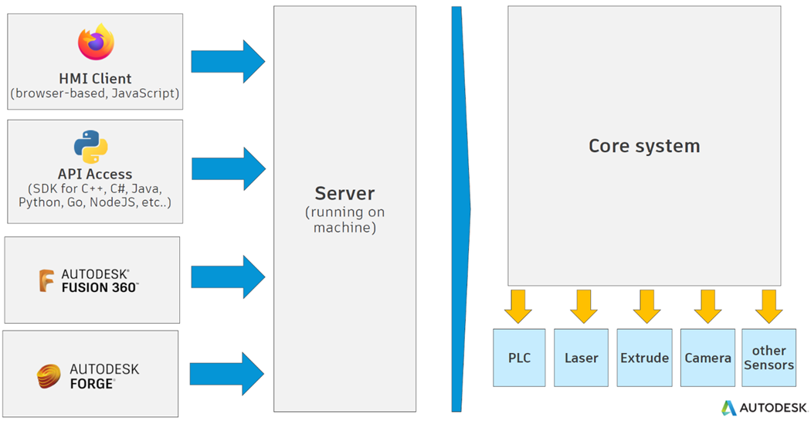

# Overview

Brief Introduction to Autodesk Machine Control Framework

## Concept

Currently, Autodesk Manufacturing software is not directly controlling the hardware: our customers use various proprietary software from the machine builders to make the part. Autodesk Machine Control is an open source middleware framework to integrate CAD/CAM software with machine hardware systems into a production-ready, complete and cohesive closed loop system, that can produce high quality products out of the box. Autodesk Machine Control is an Android equivalent open source framework for any manufacturing machines/robots and it reduces the costs and time-to-market for any machine builder in a similar way to what Android did for the mobile phone industry during the last decade. Because of the collaboration between Autodesk Research, Fusion 360 and external organisations, any engineering organization can quickly combine the Autodesk CAD/CAM stack together with any manufacturing hardware to create beyond-state-of-the-art industrial manufacturing system with a fraction of the traditional effort.
With ever-growing amounts of data flow between CAD/CAM/CAE software and manufacturing hardware systems in use throughout the Design and Make cycle, connecting them all is becoming more important than ever before. Businesses that win are the ones that establish direct connection between Design and Make. Autodesk has a competitive advantage of Design to Make software as well as leveraging Forge Data Platform. However, our tools do not yet provide machine control capability, which does not allow Autodesk to deliver end-to-end solution. Our customers are constantly looking for turnkey solutions in Design and Make space. Therefore, Autodesk needs to enter the middleware market, as this unlocks huge potential to deliver a truly integrated solution.

## How it works

Middleware bridges the gap between two or more pieces of software that don’t natively communicate. Because middleware has this extremely important purpose, it’s critical that it works well. Open source software — and open source middleware is no exception — is often more robust than not. If there are strong leaders in an open source development community, the wealth of knowledge and experience feeds into the quality and usefulness of the product. One of the most important capabilities for tools that perform a middleware function is to serve as a starting point for existing manufacturing hardware  systems that need to be connected to the design software.

Autodesk Research in collaboration with Fusion 360 presents Autodesk Machine Control – open source middleware framework that enables to bridge the gap between CAD/CAM software and machine hardware, by a modern browser-based Human Machine Interface, configurable Open APIs and unseen features like over-the-air updates and transactional timeline journaling.

Most importantly, all these features are within a single unified framework and can be applied to any industrial machinery or robots. Developers do not have to take the time to develop their own software for controlling machines, learn new tools or switch between environments — everything needed to control the machine is all in a single place with a direct connection to Autodesk CAD/CAM software stack.

As can be seen, Autodesk Machine Control bridges the gap between Autodesk CAD/CAM and the machine hardware of our users. Autodesk Manufacturing CAD/CAM software is generating design and simulation workflows and outputs build files. These build files are then imported to Autodesk Machine Control for to convert toolpath in to control logic and hardware control. Autodesk Machine Control runs on the machine and directly controls the hardware by sending the control logic to the controller. Machine controller in turn runs real time machine control while recording all the process data.

Autodesk Machine Control allows sending the control commands to the machines. It also allows receiving signals for data recording, process monitoring, and creating Digital Twins. This in turn provides data to CAD/CAM system for inspection by creating a 1st closed loop feedback to design. Another option is to send 2nd closed loop feedback within Autodesk Machine Control for quicker in-process control changes and adjustments. The 3rd closed loop feedback can be created within the controller for deployment of the quickest actions.

Autodesk Machine Control has been developed by our team in collaboration with Fusion 360 and released as fully open source code with unrestricted commercial use and can be found at the official Autodesk GitHub account:
[AMCF on GitHub](https://github.com/Autodesk/AutodeskMachineControlFramework) 

At the core of Autodesk Machine Control is the modern client server architecture, where different external applications can be connected as clients, for example: web-based HMI client, API access, Fusion 360, Forge data platform. Main server is running on the machine and connects clients to the Core system. The Core system consists of number of state machines that can accommodate and run any plugins and any drivers for any machines: additive machines, subtractive machines, robots, laser cutters, and any other industrial machine.

