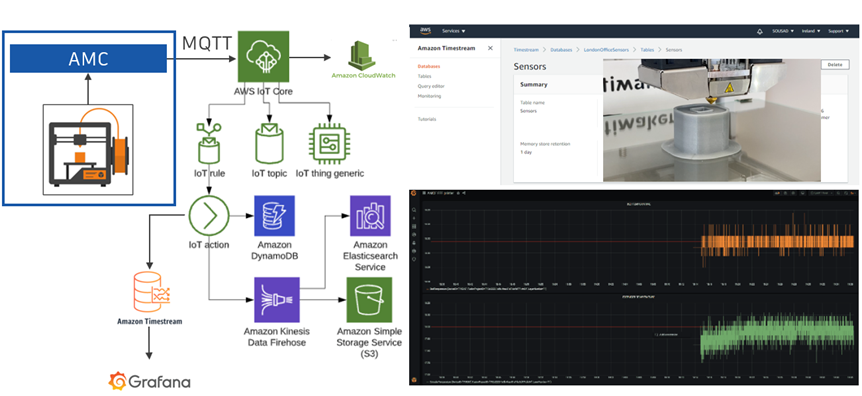
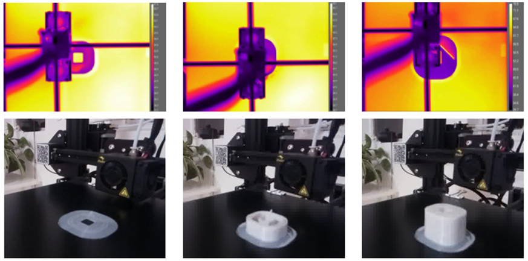
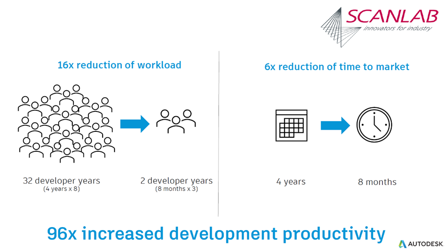

# Solutions

## Control and monitor FFF printing
Autodesk Research – Manufacturing Industry Futures has created a set of plugins to control and monitor a FFF printer. One plugin does the “printer connection”. It connects to and initialises the printer. It monitors the status of the command queue and only sends data to the printer when it is ready to receive further data. This prevents the printer from being blocked and no longer being able to receive other control commands. In this way, the plugin retains full control over the printer, can influence the printing process at any time and thus realise a "closed loop".

Classically, the complete g-code would be transmitted to the printer and then processed. However, this would lead to a full command queue and there would no longer be any possibility to influence the printing process. 

But with AMC we do have to the possibility to control the printer while printing and this is used to ask the printer for the current extruder and bed temperature as well as for the current position periodically. The plugin receives the data from the printer and stores it in the AMC internal database for further usage.
Further usage of this data could be “store and analyse data in the cloud”. To meet this requirement the plugin “MQTTconnection” was added. This plugin connects to the cloud respectively to a MQTT endpoint and sends the data, received from printer, to this endpoint using the MQTT protocol.

Another application would be the optical monitoring of the printing process. To do this the “camera” plugin is available. It connects to a camera, grabs an image of the so far printed part after each layer and stores the data in the AMC internal database for further usage.

 
 
 
 
 
 
 
 

## Collaboration with SCANLAB
We collaborated with SCANLAB – the leading provider of hard- and software of laser controls for almost every metal additive manufacturing machine in the world. SCANLAB used Autodesk Machine Control to develop their control software and have direct connection from CAD/CAM software to their hardware. The usage of Autodesk Machine Control showed huge benefits in software development productivity: from 4 years with 8 engineers earlier to 8 months with 3 engineers now.

### Autodesk Machine Control at FormNext 2020: 
["Save millions of dollars with the Autodesk Machine Control Framework"](https://www.youtube.com/watch?v=DHLzwTHs2b4) is the title of the video showing the collaboration between Autodesk and SCANLAB in using AMCF.

 
 
 
 
 
 
 
 

## Collaboration with EVOBEAM
We collaborated with EVOBEAM that develops high-precision, high-productivity processes in the automotive and aerospace industry. EVOBEAM successfully used Autodesk Machine Control for their latest high temperature powder bed fusion metal additive machine in vacuum which allowed them to implement closed loop feedback to design and simulation stages.

See the [testimonial video](https://atube.autodesk.com/media/autodesk-machine-control-evobeam-testimonial)

 
 
 
 
 
 
 
 
